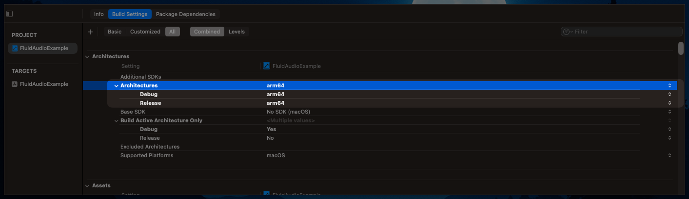

# Text-To-Speech (TTS) Code Examples

> **⚠️ Beta:** The TTS system is currently in beta and only supports American English. Additional language support is planned for future releases.

Quick recipes for running the Kokoro synthesis stack.

## CLI quick start

```bash
swift run fluidaudio tts "Welcome to FluidAudio text to speech" \
  --output ~/Desktop/demo.wav \
  --voice af_heart
```

The first invocation downloads Kokoro models, phoneme dictionaries, and voice embeddings; later runs reuse the
cached assets.

## Arm64-only builds

The Kokoro TTS stack is packaged with an `ESPeakNG.xcframework` that only ships arm64 slices. If Xcode reports `found architecture 'arm64', required architecture 'x86_64'`, point the build at an Apple Silicon destination (device or arm64 simulator) or exclude `x86_64` from the build settings. Intel Macs are not supported.



## Swift async usage

```swift
import FluidAudio
import Foundation

@main
struct DemoTTS {
    static func main() async {
        guard #available(macOS 13.0, *) else {
            print("FluidAudio TTS requires macOS 13 or newer.")
            return
        }

        let manager = TtSManager()

        do {
            try await manager.initialize()
            let audioData = try await manager.synthesize(text: "Hello from FluidAudio!")

            let outputURL = URL(fileURLWithPath: "/tmp/fluidaudio-demo.wav")
            try audioData.write(to: outputURL)
            print("Saved synthesized audio to: \(outputURL.path)")
        } catch {
            print("Synthesis failed: \(error)")
        }
    }
}
```

Swap in `manager.initialize(models:)` when you want to preload only the long-form `.fifteenSecond` variant.

## Inspecting chunk metadata

```swift
let manager = TtSManager()
try await manager.initialize()

let detailed = try await manager.synthesizeDetailed(
    text: "FluidAudio can report chunk splits for you.",
    variantPreference: .fifteenSecond
)

for chunk in detailed.chunks {
    print("Chunk #\(chunk.index) -> variant: \(chunk.variant), tokens: \(chunk.tokenCount)")
    print("  text: \(chunk.text)")
}
```

`KokoroSynthesizer.SynthesisResult` also exposes `diagnostics` for per-run variant and audio footprint totals.
